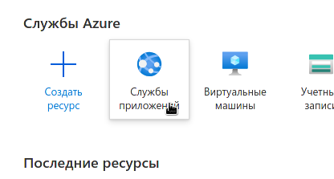
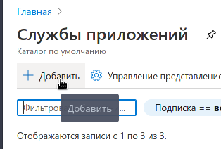
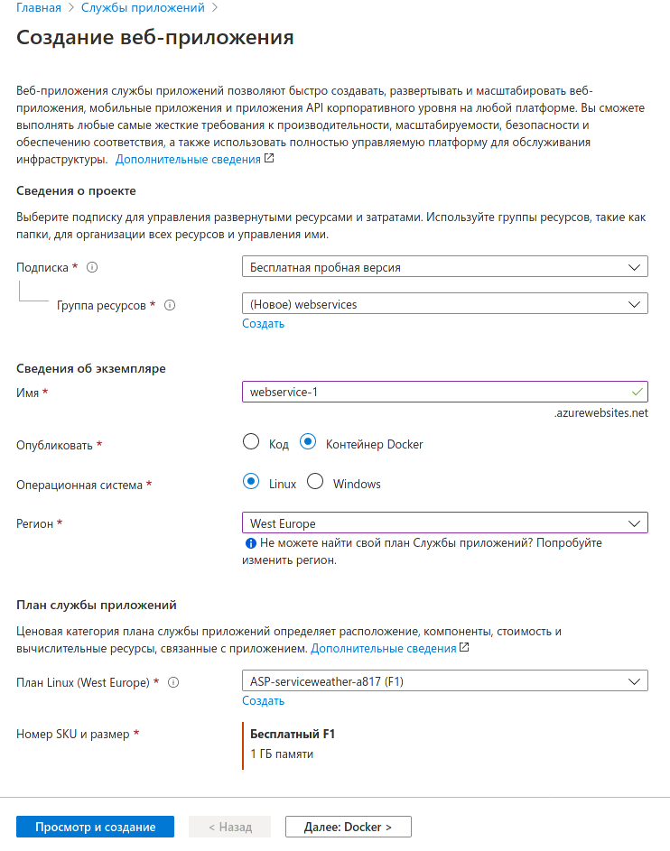
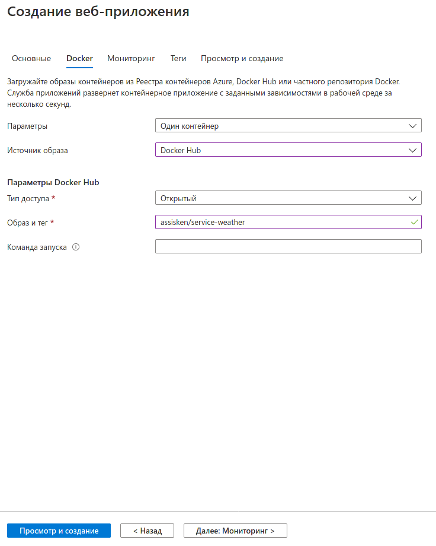
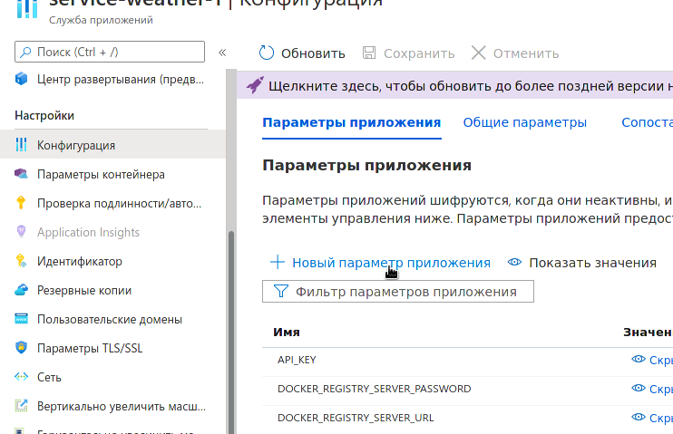
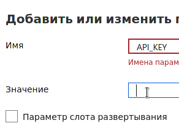
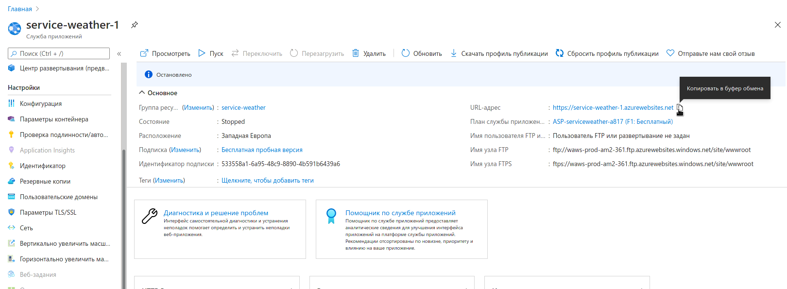

# Пятая лабораторная работа

## Задача

- Написать конфигурацию для балансировщика (любого) для сурвиса из ДЗ 1.
- Развернуть сервис из 1го ДЗ на 2х виртуальных машинах в любом облаке.
- На отдельной виртуальной машине поднять балансировщик и
настроить его на проксирование на сервис погоды из ДЗ 1.

## Решение

### Azure

Зарегистрироваться на [asure](https://azure.microsoft.com/ru-ru/free/).

Нажать на службы приложений.


Добавить.


Настраиваем, как на скрине.


Далее, как на скрине.


Нажимаем на просмотр и создание.

Проворачиваем такое со вторым сервером, называем его так же, но с цифрой "-2".

Открываем конфигурацию, параметры приложения, новый параметр приложения.


Вставляем `API_KEY`


Ок, перезапускаем приложение.

### Docker и Haproxy

Со вторым делаем ровно то же самое.

Копируем в блокнотик этот URL, он нам пригодится.


Создаём конфиг `haproxy.cfg` с таким контентом:

```ini
global
    maxconn     1024
    pidfile     /run/haproxy.pid
    daemon

frontend  main
    bind *:80
    mode                 http
    default_backend      app
    timeout              client  30s

backend app
    mode        http
    balance     roundrobin
    timeout     connect 30s
    timeout     server  1m
    timeout     queue   1m
    http-send-name-header Host
    server "ВАШ URL1" "ВАШ URL1":443 check ssl verify none
    server "ВАШ URL2" "ВАШ URL2":443 check ssl verify none
```

Создаём `Dockerfile` с вот таким содержанием:

```dockerfile
FROM haproxy:2.3
COPY haproxy.cfg /usr/local/etc/haproxy/haproxy.cfg
```

Далее создаём образ по такой команде:

```bash
docker build -t <ваш логин>/service-weather-haproxy .
```

Регистрируемся на [hub.docker.com](https://hub.docker.com/).
Переходим на [Account Settings -> Security](https://hub.docker.com/settings/security).
Нажимаем на кнопку "New Access Token".
Введите туда "MY COMPUTER", Create.
Скопируйте токен, Copy and Close.

Введите в консоль:

```bash
docker login --username <ваш логин>
```

Вставляем токен.

Далее вводим команду:

```bash
docker docker push <ваш логин>/service-weather-haproxy
```

[Возвращаемся](#azure), создаём приложение по такому же типу, НО!!!

Называем myserviceproxy, только образ и тег:
`<ваш логин>/service-weather-haproxy`.

Запускаем. Адрес этого приложения — ваша прокся, её сдавать будем. =))))))
